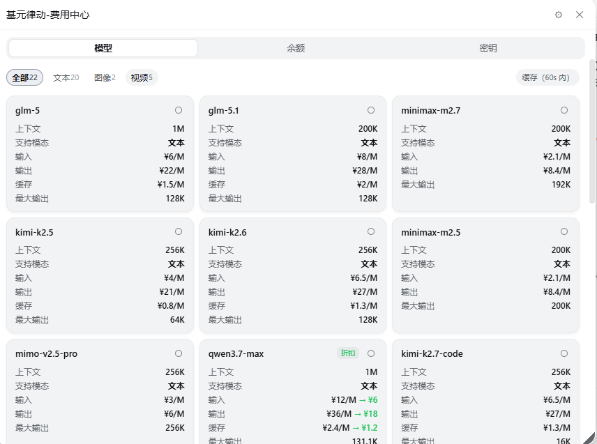
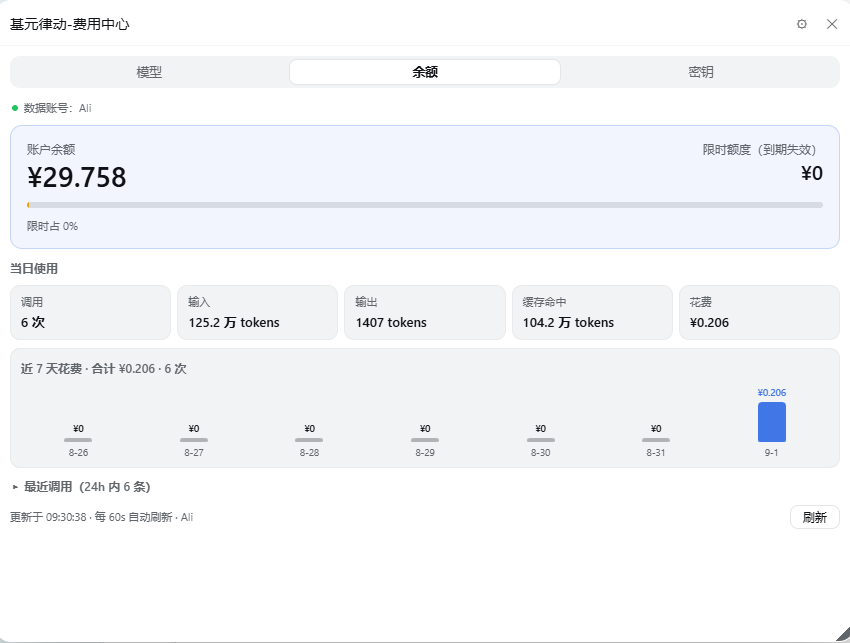
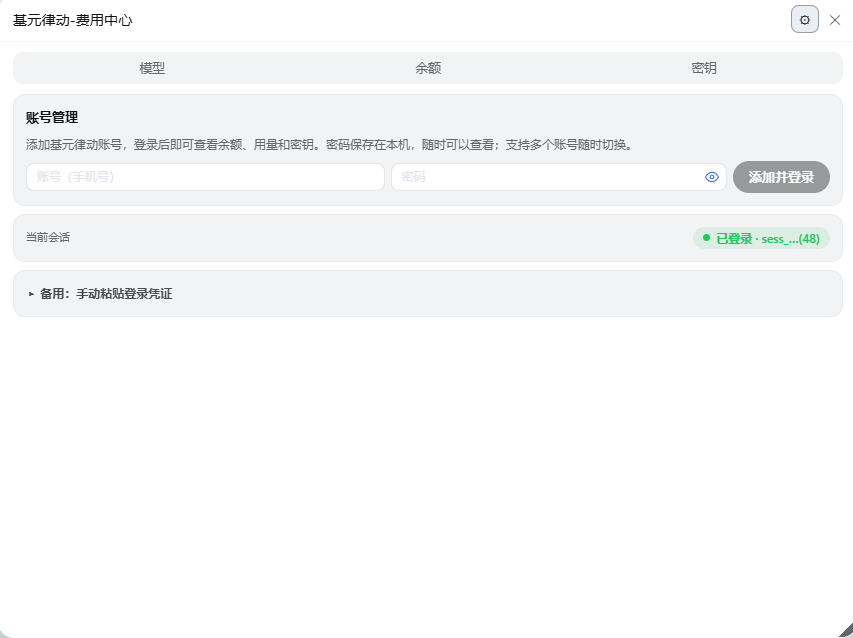
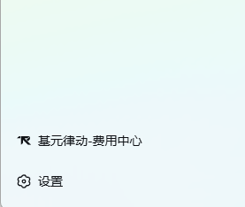

# dsh-tokenrhythm-bill

**基元律动费用中心** —— DeepSeek Harness（DSH）插件，把[基元律动 tokenrhythm.studio](https://tokenrhythm.studio) 的模型清单、账户余额、用量与密钥管理，集中到侧栏底部一个小面板里。

在 DSH 侧栏底部（设置按钮上方）点击带**基元律动品牌标**的「¥ 基元律动-费用中心」入口即可打开可拖拽面板；入口在余额临期或不足时自动点亮**预警点**，悬停可见原因。

## 界面预览

**模型页签** —— 分类筛选 + 卡片网格 + 连通检测

**余额主卡** —— 账户余额 + 限时额度占比

**设置页** —— 账号管理 + Cookie 兜底

**侧栏入口** —— 品牌标按钮 + 预警点

## 功能一览

### 模型
- 顶部**分类筛选**：全部 / 文本 / 图像 / 音频 / 视频 / 向量（带计数，口径与平台模型列表页一致）
- 卡片网格：第一行**模型 ID**（带「折扣」徽标），第二行**左来源**（无问芯穹 / DeepSeek / 百炼…，悬停看全名）**右平台状态**（在线 / 测试中）
- 明细行：上下文长度、**支持模态**（文本 / 图像 / 视频 / 音频 / 向量）、输入 / 输出 / 缓存单价（折扣价以 `→` 标出）、图片单价、最大输出
- 卡片右上角**连通状态点**：点一下即可检测该模型是否真实可用（发送 1 条极小的测试请求，约 ¥0.0004/次）——绿点 = 连通并显示延迟，红点 = 异常，悬停查看原因；60 秒内重复点击走缓存、不会重复扣费

### 余额
- **账户余额主卡**：大字展示总余额（带千分位），右侧**限时额度** + **倒计时胶囊**（≤3 天转警示色）+ **限时占比条**（一眼看出多少是「会过期的钱」），有冻结金额时一并显示
- **当日使用**：调用次数、输入 / 输出 / 缓存 tokens、当日花费（本地 0 点起统计）
- **近 7 天花费柱状图**：悬停任一柱子浮出**当日各模型消费明细**（Top 6 + 其他）
- 每 60 秒自动刷新；临期或余额不足时顶部有预警条
- 主卡上方标注**数据归属账号**（数据按账号隔离，切换账号立即刷新）

### 密钥
- 查看平台 API Key 列表（只显示掩码），匹配到本机完整密钥时可一键复制完整值
- 直接新建平台 API Key

### 设置（面板右上角 ⚙）
- **账号管理**：添加 / 一键切换 / 删除**多个**基元律动账号，密码保存在本机、随时可明文查看
- **备用粘贴**：网页会话 Cookie（`tr_session`）兜底登录（默认折叠，用的时候展开）

## 快速开始

1. 通过 DSH **插件市场**安装 `dsh-tokenrhythm-bill`（或在本机 profile 安装后）**重启 DSH**
2. 打开侧栏底部「¥ 基元律动-费用中心」→ 右上角 ⚙ → 添加基元律动**账号和密码**并登录（一次性）
3. 回到「模型 / 余额 / 密钥」页签即可使用

> **平台登录接口不可用时**：浏览器登录 [tokenrhythm.studio](https://tokenrhythm.studio) → F12 → 应用 → Cookie → 复制 `tr_session` 的值，粘贴到「备用：粘贴网页会话 Cookie」框中保存（直接粘贴 `tr_session=sess_…` 整串也认）。Cookie 过期后余额页签会引导你回设置重新登录。

## 隐私说明

- 账号密码与会话 Cookie 只保存在**本机**，**永不下发浏览器**
- 界面中的 API Key / Cookie 一律显示掩码；完整值仅在你主动点击时才复制到剪贴板
- 模型连通检测会向平台发送 1 条最小推理请求，消耗极少量额度

## 常见问题

- **切换账号后图表变成 ¥0？** 余额、用量、趋势都按账号隔离——切到没用过的账号自然为空，切回原账号即恢复原数据。
- **连通检测一直失败？** 先确认已配置基元律动 API Key（`settings.yaml` 或凭据文件）；若是新装插件，请先重启 DSH。
- **余额显示「会话已过期」？** 到设置页重新登录，或重新粘贴 Cookie。
- **模型连通检测会花多少钱？** 每次只发 1 条 1-token 的最小请求，约 ¥0.0004；60 秒内重复点击走缓存，不会重复扣费。
