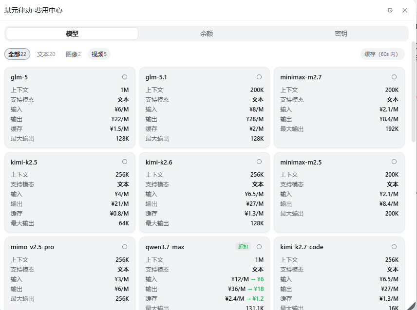
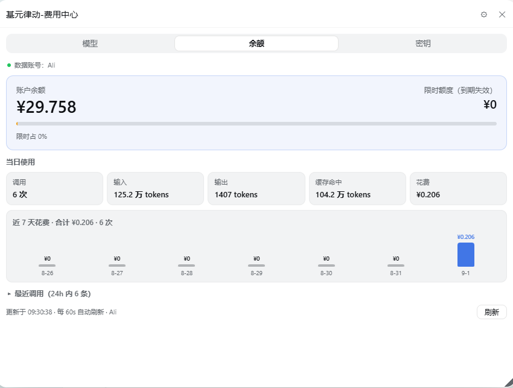
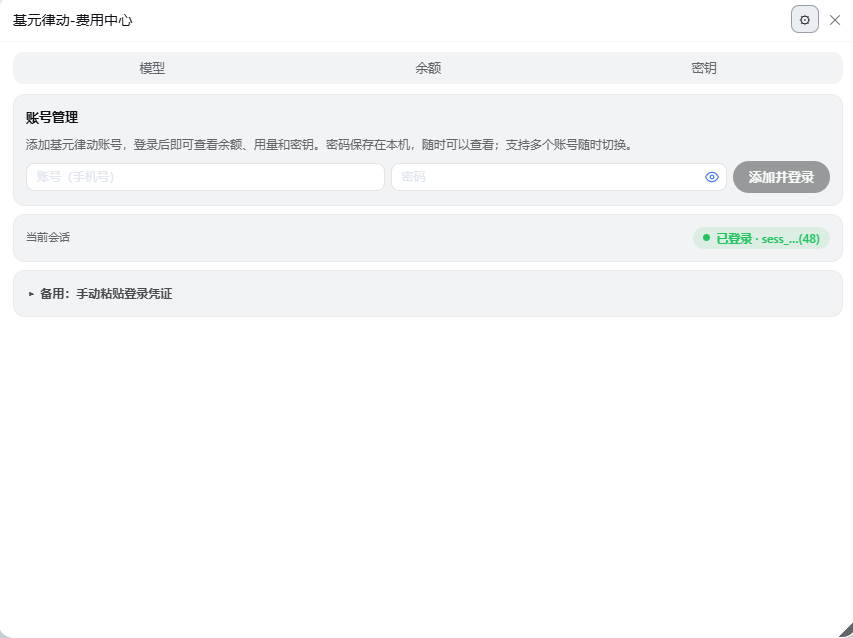
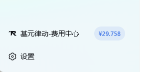

# dsh-tokenrhythm-bill

**基元律动费用中心** —— DeepSeek Harness（DSH）插件，把[基元律动 tokenrhythm.studio](https://tokenrhythm.studio) 的模型清单、账户余额、用量、密钥管理与服务状态，集中到侧栏底部一个小面板里。

在 DSH 侧栏底部（设置按钮上方）点击「基元律动-费用中心」入口即可打开可拖拽面板；也可以直接按 **`Ctrl+J`**（macOS `Cmd+J`）呼出/收起。入口左侧是**品牌标 + 名称**，右侧常驻**总余额胶囊**（切号即刷、预警转琥珀色）；**悬停入口**可浮出**限时余额时间线**——逐笔列出每笔限时额度和「N 天后失效」（实时计算，无限时额度时不显示）；侧栏收起时只保留品牌图标。

## 界面预览

> 截图取自 v0.5.2（当时是三页签）。当前版本已扩展为 **余额 / 用量 / 模型 / 状态 / 密钥** 五个页签 + 标题位提供商切换器（基元律动｜阶跃｜ZCode），版式沿用同一套设计令牌，功能以正文为准。

**模型页签** —— 分类筛选 + 卡片网格 + 状态联动



**余额主卡** —— 账户余额 + 限时额度占比



**设置页** —— 账号管理 + Cookie 兜底



**侧栏入口** —— 品牌标 + 常驻总余额 + 预警点



## 功能一览

### 模型
- 顶部**分类筛选**：全部 / 文本 / 图像 / 音频 / 视频 / 向量（带计数，口径与平台模型列表页一致）
- **文本在前、图像在后，价格升序**：图像模型按图片单价、文本模型按输入单价（有折扣取折扣价）；无价格的排组尾，同价内保持平台原序
- 卡片结构对齐平台模型页：**名称 + 状态胶囊**（在线 / 测试中）headline，**模型 ID + 来源**（无问芯穹 / DeepSeek / 百炼…）副行
- **规格 / 价格两栏**：序列长度、支持模态（文本 / 图像 / 视频 / 音频 / 向量）、最大输出长度；输入 / 输出 / 缓存命中单价（折扣时划线标原价，¥x.xx/M）、图片单价
- 折扣模型：标题行最左带**「折扣」徽章**（实底绿渐变 + 白字，行内排布、不影响卡片布局），价格栏同时划线标原价；状态胶囊只显示平台状态（在线 = 绿点 / 测试中 = 琥珀点）——模型页签已无探测联动，探测详情看「状态」页签

### 余额
- **账户余额主卡**：大字展示总余额（带千分位），右侧**限时额度** + **倒计时胶囊**（≤3 天转警示色）+ **限时占比条**（一眼看出多少是「会过期的钱」），有冻结金额时一并显示
- **占比条是两段色（v0.5.22 定稿）**：**主题蓝＝非限时额度**（余额里不会过期的那部分，条子的左段/底色），**橙＝限时额度**（会到期失效的那部分，**落在最右端**，`justify-content:flex-end` 推过去）。原先轨道是灰底、橙段在左，只看得出「限时占多少」；现在两段各自有语义、且限时贴着右端。限时额度恰为 0 时不画橙段（填充段带 2px 最小宽，留着会在纯蓝条右端挂一颗橙色小点）。橙色在本插件里**专属「限时额度」这一语义**：ZCode 页那张占比条走中性配方（灰轨道 + 主题蓝填充），不出现橙色
- **当日使用**：调用次数、输入 / 输出 / 缓存 tokens 与命中率、当日花费（本地 0 点起统计）
- **资金明细（v0.5.8 新增）**：把账户余额拆回来源逐笔列出——充值本金置顶，之后每笔赠送额度一行，含**赠送多少 / 已用多少 / 还剩多少 / 何时到期**，按到期早晚排序（临期的排最前）；已用完的（`USED_UP`）也保留，否则就说不清「这一路总共赠送过多少」。摘要行另给「累计赠送」「未到期」两个数
- 每 60 秒自动刷新；临期或余额不足时顶部有预警条
- 主卡上方标注**数据归属账号**（显示平台用户名，数据按账号隔离，切换账号立即刷新）
- **侧栏入口常驻余额**：不打开面板也能在侧栏底部看到当前账号余额，切换账号随之更新；**悬停入口**浮出限时余额时间线（逐笔列出每笔限时额度和「N 天后失效」，无限时额度时不显示）；设置页可把胶囊切换为**总余额 / 限时总余额**二选一
- 更长周期（30 天）的用量看「用量」页签；本页不重复放 7 日柱状图与「最近调用」——那两块每次刷新都要翻几十页 call-logs，平台约每 3 个请求就 503 一次（阶跃账号卡展开区那组 7 日 Credit 柱条走的是阶跃自己的接口，与本页无关）

### 用量（v0.5.5 新增，0.5.6 / 0.5.8 优化）
- **近 30 天主卡**：左边**总花费**（主值），右边**调用次数 + 总 Tokens 并排**（都是「用了多少」的量级口径，放一起才好对照）；下方 4 张指标卡做细化拆分：成功 / 失败、中止、输入 / 输出、缓存命中率
- **30 天热力日历**：一格一天，格子底色随当日花费深浅变化（越贵越浓），金额直接摆在格子里；周末列表头与空格另有区分。**标题行右上角有覆盖度角标**（`N / 30 天有调用 · 明细起 XXXX-XX-XX`）——空格子占多数是常态，角标说清「空的是真空」而不是「没加载出来」。悬停**有调用**的格子才浮出当日明细（模型列表 + 各自金额 / 调用数、开源节省）——当天无调用的格子没有可看的东西，不弹浮层。浮层靠左/右边缘的格子自动贴边、第一行的翻到下方，不会被面板裁掉
- **按模型 / 客户端拆分**：**左右并排各占一半宽度**（信息量相当、也常要对照着看，上下排会把面板撑到要滚两屏），各取花费前 6 名排行，带占比条
- **口径说明写死在界面上**：日历只统计最近 30 天；平台没返回明细的日子画虚线框 + 「—」；两个上游接口的 30 天合计若出现分差会显式提示「以汇总为准」，不悄悄选一个
- 每 90 秒自动刷新，可手动刷新

### 状态（自定义检测，v0.5.7 起）
- 官方状态站 2026-09-14 起停更，原先基于它的「服务总览横幅 / 厂商分组折叠面板 / 24h·7d·90d 可用率视图」整块移除；状态页改为**用你自己的 Key 实测**
- **自定义检测卡**：勾选要检测的 **chat 类模型**（图像 / 音频等本就不可探测，直接不列出），点「立即检测」对每个选中模型发一次**真实 1-token 推理**（约 ¥0.0004/模型，计入你的 API Key 账单）；也可选**定时间隔**（5 / 10 / 15 / 30 / 60 分钟）自动重测——**只在面板打开期间跑，关面板即停**
- **结果逐行给出**：状态点（正常 / 降级 / 失败）+ 模型名 + 首字延迟；**没测过的显示「未检测」**，不伪装成正常；失败原因挂在行内 tooltip，完整错误不占版面
- 与模型页签的分工：模型卡上的胶囊只表示**平台标注**的在线 / 测试中；「此刻我的 Key 能不能打通这个模型」看这一页

### 密钥
- 查看平台 API Key 列表（只显示掩码），匹配到本机完整密钥时可一键复制完整值
- 直接新建平台 API Key
- 阶跃首页「密钥」页签里维护阶跃控制台的「接口密钥」：新建 / 复制完整值 / 删除（立即失效）；完整值只在创建时展示一次，列表只显示掩码，复制走本机 host 按需单取，不经过任何服务器

### 阶跃（StepFun）
- **提供商切换**：面板标题右侧的 `基元律动 | 阶跃 | ZCode` 切换器切到阶跃（未配置阶跃账号时这一段不出现）
- **卡面配色（v0.5.20 修正）**：账号卡改用与模型卡同一套 **浅灰 soft 卡面** + 细描边 + 抬升投影，卡内「账户余额 / Credit 月池」两格**反相为白**。此前卡面用的是 layer-1 实底白，而面板底层是 layer-2（也是白）——同色之下整张卡只剩一根 4% 描边，用户直接反馈「没有颜色、看不出卡片边界」。未查询的 `.dim` 卡仍是虚线框 + 透明卡面，其两格回落 soft，保持原来的观感；**「显示中」那一态保持原样式不动**（用户指定）：accent 8% 叠在白卡面上 + 格面 soft + 左侧 3px accent 竖条
- **「账户」页签（v0.5.9 起账号 + 用量二合一）**：把设置里配的**全部阶跃账号**各列一张卡，每张卡带该账号的**账户余额**与**Credit 月池**（百分比 + 内嵌进度条 + 档位 / 到期 / 续费状态），**Credit 格右上角另挂「↻ M/D 重置」**——月池什么时候刷新剩余额度，悬停看完整时间与剩余天数。账号名后面跟一个**密码胶囊**：默认打码（固定 6 个圆点，连长度都不透露），点一下才显明文，同一时刻只展开一个；没有保存密码的旧账号显示「未存密码」且不可点。每张卡可单独**查询此账号 / 展开明细**，卡上可直接**删除账号**（两段式确认）；账号**增删都在这一页**，设置页只留一个跳转入口——列表和增删同一屏，不再两处维护
- **「显示」= 纯显示偏好**：让侧栏胶囊、主卡和「接口密钥」页都跟着换成这个账号的数据。各账号会话分槽并存，**不切换登录身份、不清缓存、不触发重登**。**页签标签直接带账号**（`密钥（138****0001）`）——增删密钥不可逆，归属不该藏在二级页面里，切了「显示」不进页签就知道这堆密钥是谁的；账号还没探明时退回纯「密钥」，页签文本统一次 `nowrap` + 省略号防长账号名撑爆两格布局。密钥页顶部另有一行归属标签（「「138****0001」的密钥」），切显示账号时列表会跟着重拉——不写清楚的话，用户照旧列表删/建，动的其实是另一个账号的密钥
- **会话按账号分槽**（键 = username 小写）：`stepRpc` 省略 username 时按 `pickStepAccount` 的口径兜底到活跃账号，所以 `stepGetSess` 的省略态也必须兜底到 `activeAccount`——多账号重构时这里漏了，而四个密钥 `stepRpc` 又恰好都没传 username，于是 `ListAccessKeys` 稳定报「无可用会话」（已修）。现在四个密钥调用（列表 / 取完整值 / 创建 / 删除）全都显式带 username，测试对每处调用逐一断言。**显式传了 username 却没会话时不许兜底到活跃账号**——那正是「查 B 回了 A 的结果」这类张冠李戴 bug 的温床
- **重置时间的取值与兜底**：优先 `subscriptionResetAt`（订阅月池总表），缺失时降级到 `type=1` 桶的 `nextResetAt`。这个字段**没有实测过**（schema 注释标称秒级、与 `expired_at` 同口径），所以加了合理性窗口 `[今天-1年, 今天+3年]`——窗口外一律不显示，**宁可不显示，也不显示一个公元 5 万年的错日期**。剩余天数走**日历日口径**（0=今天、1=明天、负=已过），与限时额度到期天数一致；不用 `ceil`，否则「今晚就重置」会被算成「还剩 1 天」
- **密码不进列表响应**：账号清单只回 `pwMask` 掩码，明文走独立路由 **按需单取**（只认账号池内的 username，池外 404）——和密钥「列表只回掩码、完整值按需单取」是同一口径。删除账号时会顺手收掉已展开的明文
- **主动作收敛成一个「查询余额」**，放在页签右上角：它才对全部账号真发请求（会话失效的会先自动续期/登录，然后并发拉取），是这一页最重的动作。底部不再放「刷新」——那个按钮只是读 host 本地缓存、零网络，点下去数字不会变；它该做的事 60 秒自动轮询已经在干，且和卡片脚行真查单账号的「刷新」同名不同义，纯属误导
- **三种卡片状态一眼可辨**：**显示中**（主色描边 + 淡主色底 + 左侧竖条）、**已查询**（常规卡）、**未查询**（虚线框 + 无底色 + 「未查询」角标）。不再用整体压暗表示未查询——那会把卡上的删除按钮压得像禁用的，且一屏卡片里看不出差别
- **「显示」按钮是显示偏好，不是切换登录**：点它只把侧栏胶囊与主卡的数据源换成这个账号。各账号会话分槽并存，换显示目标不清任何人的缓存、不触发重登
- **明细默认折叠**：点「展开 ▼」才显示该账号的**近 7 日 Credit 消耗柱条**（最早一条仍在 7×24h 内才敢叫「近 7 日」，否则如实标「最近 7 个有记录日」并说明无调用的日子平台不留痕，不冒充）。柱条排在「展开/收起」按钮**下面**——按钮是这张卡的收尾操作，明细是被它展开的内容，阅读顺序该是先看到开关、再看到展开出来的东西。没查过的账号不显示展开按钮，只给「查询此账号」
- **套餐档位水印**：卡片上压一档 52px 的档位水印（`Mini` / `Plus` / `Pro` / `Max`，四档四色：蓝 / 青 / 紫 / 琥珀，透明度 12%），档位信息只在这一处出现。**认不出的档位一律不画**——画个错档位比不画糟得多。垂直位置写死 `top:44px` 而非百分比：卡片一展开明细就长高，相对整卡定位的水印会跟着跑（实测「一点击展开，水印的位置就变了」）
- **Credit 副行只留到期日**：`12月20日 到期`。档位已由水印表达，套餐名与自动续费状态再占一行纯属重复，已删；没有可显示的到期信息时整行不渲染，不留空占位
- **打开面板即自动查全部账号**：各账号会话**独立保存**（落盘），登过一次就长期复用。平台用户 token 寿命 30 分钟（2026-09-24 实测 `accessToken.duration` = 1800s，cookie token 与 JSON token 的 JWT `exp` 均为 30 分钟），但**过期后不用重新输密码**：`PassportService/RefreshToken` 能用旧 cookie（`Oasis-Token` + `Oasis-Webid`）换回本人的新会话——实测过期 1 分钟的 token 打 RefreshToken 返 200、`mode=2`、身份指纹一致、新 token 打 RPC 直接 200。临期前 5 分钟主动续，一路用不到 401。稳态下打开面板：已有凭据的账号**零请求**，只有一条凭据都没有的账号才需要首次登录；会话齐了之后**并发**查询全部账号，不用逐个等。底部有 `N / M` 进度，撞平台软频控会自动中止并说明卡在哪个账号
- **续期有身份核对（防串号）**：平台对「签名非法的 token」只会铸出设备匿名令牌（`oasis_id` 不同、RPC 401）。所以续期拿到新 token 后必须比对 `oasis_id|organization_id`，对不上就整条会话丢掉并落回密码重登——绝不让 A 的设备令牌顶替 B 的会话
- **切号不再清别人的会话**：各账号数据与凭据各自独立，切走再切回仍是本地缓存命中，不必重新登录
- **未查过的账号显示「—」而不是 ¥0**：「查到了 0」和「没查过」是两件事，界面不许含糊
- **侧栏入口胶囊**：阶跃模式下可显示 Credit 月池剩余 % 或账户余额（设置里二选一），悬停仍浮出基元的限时余额时间线

### ZCode（v0.5.0 新增，默认关闭）
- **总开关**：本插件面向所有用户发放，读本机 ZCode 凭证的能力**默认关闭**——设置弹窗「ZCode 集成」卡里显式「开启」后，面板标题切换器才会出现第三段「ZCode」，插件后台才被允许访问 `~/.zcode/v2`（host 侧路由同样有门禁，双重保险）；关闭即停读，面板恢复原样
- **用量页签**：读取本机 `~/.zcode/v2` 的 ZCode 桌面端登录凭证，直连官方接口查询当前套餐（档位 / 到期 / 剩余额度 / 已用占比）；BigModel 通道优先，自动回退 z.ai 余额接口，兼容个人订阅与活动赠送多套餐切片。每 60 秒自动刷新
- **主卡读法（v0.5.23 定稿）**：大字＝**剩余额度**百分比，下方的占比条也画**剩余额度**（主题蓝，左端起；剩余为 0 时不画填充段，避免 2px 最小宽在空条左端留一颗蓝点）；图例只留互补的「已用 X%」。**不再显示数据来源那一行**（用户要求删除——来源是内部实现细节，不占版面）
- **活动页签**：列出可领取的 ZCode 活动套餐（赠送内容、周期），一键领取——领取前自动打激活埋点，通过阿里云验证码（先 8 秒无感验证、风控时转滑块）后自动提交；验证码弹窗页由插件后台伺服，若被页面 CSP 拦截会自动回退到 127.0.0.1 一次性端口完成，结果回传面板
- **入口胶囊**：切到 ZCode 时侧栏胶囊同步换成 ZCode 身份（闪电图标 + 套餐剩余百分比），无数据时自动回落基元余额
- 凭证解密、token 候选与请求头伪装逻辑移植自开源工具 [zcode-switch](https://github.com/pjpv/zcode-switch) v1.5.4（MIT），并用其跨语言测试向量对拍锁定
- **安全与风险**：ZCode 凭证只在插件后台内存与 `~/.zcode/v2` 本机文件中出现，浏览器只见掩码；相关接口为官方未公开接口、请求头伪装成桌面端，存在被平台风控的可能，请自行斟酌使用

### 快捷键（全局，跨三个提供商）
- **`Ctrl+J` 呼出/收起面板**（macOS 为 `Cmd+J`）：按一下开、再按一下关，不必去点侧栏入口
- 键位走 DSH 官方的快捷键服务，因此会自动列进 **设置 → 快捷键**，搜「费用中心」即可改键，也可以清空改成「仅菜单呼出」——不需要本插件自己再造一套键位配置界面
- 该键在**页面和输入框里都生效**（否则面板开着、焦点在密码框时按不关），但**有模态对话框开着时不动作**——浮层藏在模态后面开合，只会让人以为快捷键失灵
- **这是应用内快捷键，不是全局热键**：DSH 没有把 Electron 的 `globalShortcut` 开放给插件，所以 DSH 窗口不是焦点时按了没反应
- **web 端默认给 `Ctrl+Alt+J`**：浏览器不转发 `Ctrl+J`（那是「下载」），只承认 `primary+alt` / `primary+shift` 这类双修饰组合。若在 web 端也写 `Ctrl+J`，快捷键注册会直接失败，桌面端一并失效
- 快捷键插件被禁用/缺失时，本插件静默没有快捷键，面板与侧栏入口完全不受影响

### 对话输入行的两个图标按钮（v0.5.11 新增，v0.5.13 起为图标方案，v0.5.14 起交互简化，v0.5.16 起失败可见）
- **计划** 与 **压缩** 两个**图标按钮**挂在对话输入行的**模型选择器左边**（DSH 的 `conversation.input.right` 槽位：DOM 上排在模型选择座之前、同处 `.trailing` flex 组，该组无 `row-reverse`）。顺序为**计划在左、压缩在右**（压缩紧邻模型选择器）。图标路径与官方输入行控件同源（16×16 网格），28×28 方形、图标 14px；文案放在 `aria-label` 与 hover 提示里，不占版面
- **输入行一个文字都不出**：两个按钮都成功静默、失败只写进自己按钮的 tooltip（`· 上次失败：…`）。压缩按钮旁原先那条「压缩中…／结果／报错」回显行已整条删除，连自动消失的计时器与对应 CSS 规则一并清掉（不留没人渲染的死规则）
- **失败必须有非文字反馈**：只写 tooltip 的话，一次失败看起来就是「按钮坏了、点了没反应」（实测踩过）。所以失败时对应按钮的**图标转红 6 秒**后自动恢复，原因仍在 tooltip 里——不违反「不出文字」，但绝不会静默
- **对话正在跑时压缩按钮禁用**：判据取会话快照的 `running`（与官方 InputBar 取的是同一个字段）——轮次进行中平台一定拒绝 `/compact`（活动中的压缩／非空闲 agent），不该给一个点了必然失败的按钮。**计划按钮不受这个条件影响**（它只在自己的命令在飞时禁用）
- **压缩** = 执行官方的 `/compact`：把较早的对话历史替换为一条摘要，**不消耗模型轮次**。命令自己的结果仍照常出现在**对话里的命令行**（DSH 渲染 `conversation.chat.commandview`）：没有可压缩历史是 `No compactable history yet.`，轮次占用中是平台侧的固定文案「暂不可用」——**按钮这一侧不再复述这些文字**。**上下文占用超过 60% 时按钮转红**（浅红底 + 红图标 + 红描边），当前百分比也写进 tooltip；口径与官方 ContextMeter 逐字一致：`min(100, round((projectedTokens ?? pressureTokens) / contextWindow * 100))`，拿不到投影时不红
- **计划** = 切换计划模式：未激活时执行 `/plan`；激活后按钮转蓝（accent 高亮的「计划中」态），再点执行 `/plan off` 退出。状态读的是**宿主投影**（`plan` 的 `{active, pending}`，宿主折叠值）而非本地猜测——与官方计划片同一数据源
- **不再显示 `/plan` 在对话里的命令行**：那句「Plan mode on. Use /plan off to leave.」/「Plan mode off.」是命令的返回值文本，DSH 会把命令运行渲染成一行（`conversation.chat.commandview`，按命令名分派）。本插件占住 `plan` 这个键并渲染空，那一行就不再出现。**只藏 `plan`**——`/compact` 的结果（压缩了多少条历史、省了多少 token）是有效信息，照常保留
- **命令桥固定三个业务参数（只面向桌面端 DSH 2.0.x）**：`commands.execute(agentId, line, submittedAttachments)`——第三个是「本次提交的附件」，按钮调用没有附件，所以传 `[]`（之后才是可选的取消信号）。少传会在**发出 RPC 之前**就被客户端网关拦下抛错（实测 `client api: commands/execute expected 3 business argument(s) …, got 2`），表现就是「点了没反应」。本插件不再为更早的两参数契约做兼容：v0.5.18 试过读 typert 描述符自适应实参个数，v0.5.19 起直接写死桌面端契约，少一层会猜错的东西
- **明细字段不并排**：模型卡的规格与价格原本拆成两个 `dl`、各占一栏，现在合成一个单栏 `dl` 逐行列出（用户指定「不要并排」）
- **默认宽度一行 3 张模型卡**：网格轨道下限抽成锁定令牌 `--mb-mc-min-w: 190px`，同时把面板默认宽度从 560 提到 660（`DEFAULT_PANEL_W`，默认几何 / 拖拽兜底 / prefs 兜底四处同源）。列数 = `floor((面板宽 − 34 + 8) ÷ 198)`：面板 660（新默认）与 661 都是 **3 列**（卡宽 ≈203px），拖到 ≥818 才自然变 4 列，<620 回落 2 列、<422 单列；骨架屏网格同下限，加载态不跳列。面板宽度存在 prefs 里，已有安装的实际宽度不受默认值改动影响（老默认 560 仍是 2 列）
- 执行期间两个按钮都禁用，防重复提交；执行期间切了会话则丢弃这次结果，不会串到另一个会话
- **边界**：本槽位在轮次进行中**依然渲染**（DSH 的 `.trailing` 无条件渲染 `rightItems`，只有模型选择座会进入 locked 态），所以「轮次中不可用」这件事必须由按钮自己禁用表达，而不是指望它被隐藏；没挂 `dsh-command-compact` / `dsh-plan-mode` 时，对应按钮不出现（不摆一个必然报错的按钮）；命令桥缺失时连注册都不发生，**面板与余额功能完全不受影响**
- 计划模式激活时官方还会在输入行最左端显示一个「计划」片（那是退出入口），两者并存、互不冲突
- **「模式切换通知」这一条藏不掉**：DSH 在模式真正切换时会写入一条 `notice` 形式的用户消息（「The user switched this session to plan mode.」/「…back to the default mode.」）。本插件**无法只挑计划模式那一类**隐藏——它的 DOM 钩子（`data-context-summary`）被 8 种 notice 共用（模型切换、子代理完成、任务/目标、webhook、工具提醒…），按 DOM 隐藏会把那些有效通知一起干掉；宿主侧也没有开关（`dsh-plan-mode` 的 config 只接受 `section`，未知键直接加载失败）。真要去掉，只能接受「所有 notice 行都不显示」，需要的话说一声

### 设置（面板右上角 ⚙，弹窗打开）
- **账号管理**：添加 / 一键切换 / 删除**多个**基元律动账号，密码保存在本机、随时可明文查看
- **入口胶囊余额**：侧栏入口胶囊显示「总余额」或「限时总余额」，点击即切换并记住选择
- **插件更新**：自动比对 npm 最新版本（24 小时缓存），有新版时状态转高亮并提供「复制更新命令」，只提醒不自动执行
- **备用粘贴**：网页会话 Cookie（`tr_session`）兜底登录（默认折叠，用的时候展开）

## 安装说明

任选以下一种方式安装，**安装后需重启 DSH**，侧栏底部才会出现入口。

**方式一：插件市场**（收录后可用）

在 DSH 插件市场搜索「基元律动费用中心」或 `dsh-tokenrhythm-bill`，一键安装。

**方式二：命令行 · npm 源**（推荐，秒级安装）

```sh
dsh plugin --profile web add dsh-tokenrhythm-bill
```

> 已装过旧版本？重复执行上述命令即可**更新**到最新版，然后重启 DSH。

## 首次配置

1. 点击侧栏底部「基元律动-费用中心」入口 → 右上角 ⚙
2. 添加基元律动**账号和密码**并登录（一次性；密码只保存在本机）
3. 回到「余额 / 用量 / 模型 / 状态 / 密钥」页签即可使用（面板默认落在余额页），入口右侧会常驻显示当前账号总余额

> **平台登录接口不可用时**：浏览器登录 [tokenrhythm.studio](https://tokenrhythm.studio) → F12 → 应用 → Cookie → 复制 `tr_session` 的值，粘贴到「备用：粘贴网页会话 Cookie」框中保存（直接粘贴 `tr_session=sess_…` 整串也认）。Cookie 过期后余额页签会引导你回设置重新登录。

> **会话自动续期**：登录成功后 Cookie 保存在本机并自动复用；粘贴新 Cookie 即完成切换账号（自动识别身份）。会话过期时，若该账号已保存密码则**自动重登同一账号**并继续刚才的操作，全程无感；未保存密码的账号才会提示重新登录。

## 提供商名册从哪来

余额 / 模型 / 密钥页签要知道「哪个 baseURL 是基元律动」，靠的是 DSH 的 LLM 提供商名册（`llm-pi-ai.providers`，`baseURL` 含 `tokenrhythm` 才算余额可用）。这个名册的位置随 DSH 版本变过：

| DSH 版本 | 活存储 | 本插件的读法 |
|---|---|---|
| 0.1.6 及更早 | `~/.dsh/settings.yaml` 的 `llm-pi-ai.providers` 段 | 直接读（flow / block 两种布局都支持） |
| 0.1.7 及以后 | `~/.dsh/profiles/<name>/cordis.patch.yml` 里 `- id: llm-pi-ai` 条目的 `config.providers` | 回退读补丁层 |

> **为什么会有这张表**：0.1.7 起 DSH 把 `settings.yaml` **废除**了——设置服务把它改名成 `settings.yaml.imported`，各段写进当前 profile 的补丁层，此后**原文件不再重建**（重建会造成第二次导入，把 Setup 默认值盖回用户的选择上）。所以升级后 `~/.dsh/settings.yaml` 消失是**正常现象**，不是配置丢了。
>
> 插件按「settings.yaml → 装着本插件的 profile 的补丁层 → 其余 profile 的补丁层 → 家目录级补丁层」的顺序取第一个非空结果，**只读不写**，绝不替你重建 `settings.yaml`。

如果面板提示「未配置基元律动（tokenrhythm）提供商」，说明这两处都没有 `baseURL` 含 `tokenrhythm` 的 `llm-pi-ai` 条目——在 DSH 设置里加一个 baseURL 为 `https://tokenrhythm.studio/v1` 的提供商即可（同一个 profile 的补丁层会自动带上，无需手动编辑文件）。

## 隐私说明

- 账号密码与会话 Cookie 只保存在**本机**，**永不下发浏览器**
- 界面中的 API Key / Cookie 一律显示掩码；完整值仅在你主动点击时才复制到剪贴板

## 常见问题

- **余额页签有几天是虚线空格？** 就是那几天没有调用。30 格里调用数与花费的合计和汇总页签是逐位相同的（实测算术：`/api/usage-daily` 分桶 30 天 = `/api/usage/panel?range=30d` 的 summary），所以空格子是真空，不是页面坏了。日历标题行右上角的角标会写明 `N / 30 天有调用 · 明细起 XXXX-XX-XX`。
- **资金明细里的行怎么还有「剩 ¥0」的？** 那是用完了的额度（`USED_UP`）。留着它是为了说清历史——「累计赠送 ¥184」这个数只有把每一笔赠送都列全才对得上；删掉用完的，账就平不了了。这些行整行压暗，不抢眼。
- **切换账号后数据变成 ¥0？** 余额、用量都按账号隔离——切到没用过的账号自然为空，切回原账号即恢复原数据。
- **阶跃「账户」页签里另几个账号显示「—」？** 那是自动补齐还没跑到它（首次冷启动要依次给缺会话的账号登一次），或撞上了平台软频控被中止——底部会写清卡在哪个账号、还剩哪些。补齐完成后切走再切回仍是本地缓存命中，不必重查。
- **余额显示「会话已过期」？** 到设置页重新登录，或重新粘贴 Cookie。
- **面板提示「settings.yaml 与各 profile 补丁层…」？** 这是 host 侧读提供商名册失败时**透出的真实原因**（0.1.7 起 DSH 已废除 `settings.yaml`，名册改存 profile 补丁层，详见「提供商名册从哪来」）。以前这类失败会被概算成一句「没有提供商」，让人照着去改一个本来没问题的文件；现在 host 说什么就显示什么。名册本身没问题却仍报错，多半是插件版本太旧。
- **`Ctrl+J` 按了面板没反应？** 三步排查：① DSH 窗口是不是当前焦点窗口（应用内快捷键，非全局热键）；② 有没有模态对话框开着（设置等模态打开时按键被刻意忽略）；③ 进 **设置 → 快捷键** 搜「费用中心」，看命令在不在、绑键是否被清空或与别的命令冲突。三者都排除后仍无效，说明快捷键服务没被加载——此时面板与侧栏入口照常可用，只是没有快捷键。
